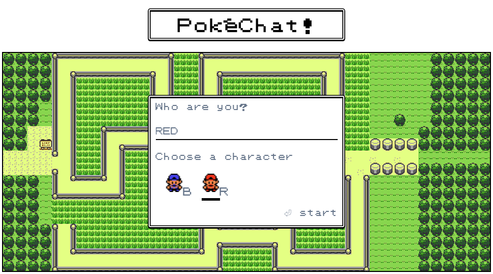

# PokéChat

This Vue client requires [the PokéChat server](https://github.com/lukeocodes/pok--chat-server) to run. Check out [the demo](https://hackathon-pokechat.herokuapp.com/) and see it all working together.

## Project Setup

Create a `.env` file which contains `VUE_APP_API_URL` with a link to your [PokéChat server](https://github.com/lukeocodes/pok--chat-server). 

It should look like this;

```shell
VUE_APP_API_URL=https://localhost:3000
```

And, install your dependencies;

```
npm install
```

### Compiles and hot-reloads for development

```
npm run serve
```

### Compiles and minifies for production

```
npm run build
```

### Lints and fixes files

```
npm run lint
```

